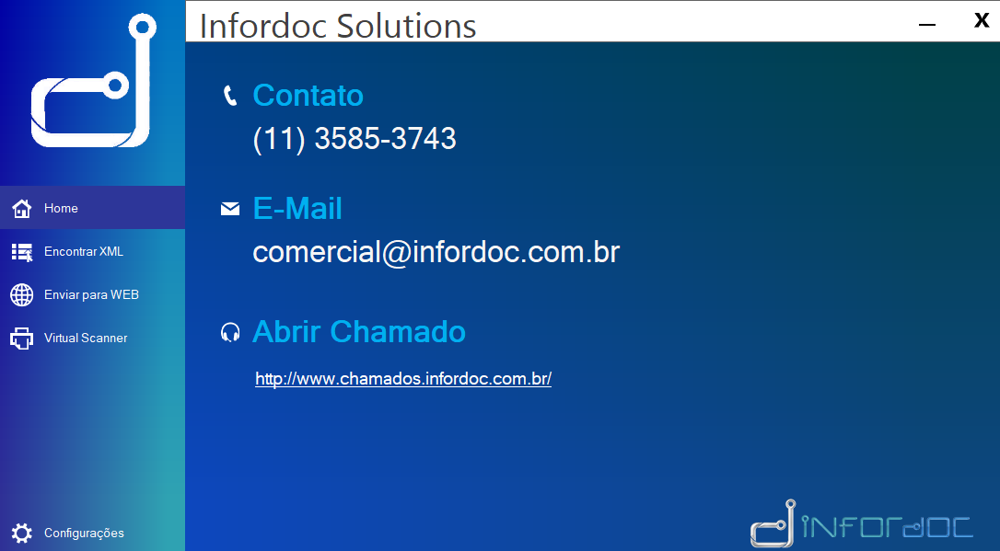

# Infordoc-Solutions
  
Software de Digitalização, manipulação de arquivos jpg,png,pdf.
  
-Reconhecimento de texto (OCR) 
-Interface Intuitiva 
-Separação de Documentos 
-Nomenclatura de Documentos 
-Recorte de Documentos 
-Assinatura Digital de Documentos .pfx (visivel ou não) 
-Marca d'agua em documentos 
-Envio dos arquivos em FTP 
-Threads que processam simultaneamente 
-Todas funções podem ser agendadas  

